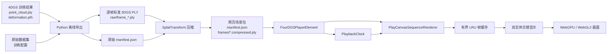
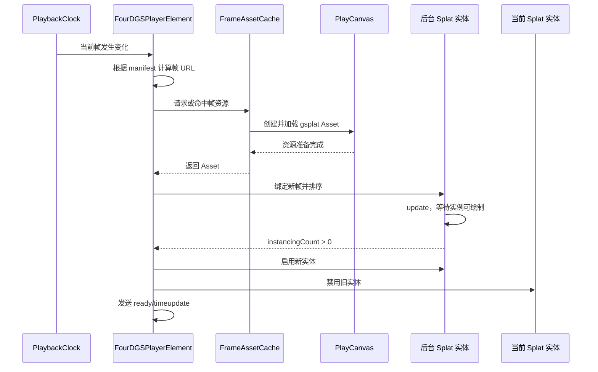

# 4DGS 网页播放器运行原理说明

## 1. 文档目的

本文说明当前 `本仓库` 插件从训练结果到浏览器显示的完整工作原理，包括：

- 4DGS checkpoint 如何离线展开成逐帧 Gaussian 数据；
- PLY 帧如何压缩并由清单组织；
- 浏览器如何控制时间、加载资源和切换画面；
- 相机与播放时间为什么能够相互独立；
- 缓存、预加载和资源释放如何工作；
- 当前方案的性能模型、适用范围与技术边界。

本文对应当前实现，不描述尚未实现的 canonical 点云加浏览器端 deformation、帧间插值或自适应 LOD。

## 2. 一句话原理

当前播放器采用“离线展开、在线逐帧播放”的方案：Python 在导出阶段将 canonical Gaussian 点云送入 deformation 网络，计算每个时间点的最终位置、缩放、旋转、不透明度和球谐颜色，再将每个时间点保存为一个完整的 3D Gaussian PLY；浏览器只负责按时间轴加载、缓存和渲染这些 PLY 帧，不运行 Python、CUDA 或 deformation 网络。

## 3. 总体架构



整个系统分为两个阶段：

1. 离线生产阶段：读取训练结果，展开时间维度，生成网页可以直接渲染的 Gaussian 帧序列。
2. 浏览器运行阶段：读取清单，根据播放状态选择帧，加载资源并交给 PlayCanvas 渲染。

## 4. 运行边界

### 4.1 浏览器直接需要的内容

```text
scene/
├─ manifest.json
└─ frames/
   ├─ frame_00000.compressed.ply
   ├─ frame_00001.compressed.ply
   └─ ...
```

浏览器不读取以下训练文件：

- `deformation.pth`；
- canonical `point_cloud.ply`；
- 原始多相机图片或视频；
- COLMAP、Nerfies 或其他数据集元数据；
- Python 配置和 CUDA 环境。

这些内容只在离线导出阶段使用。

### 4.2 当前方案不是“浏览器端神经渲染”

浏览器中没有执行 deformation MLP，也没有根据连续时间实时生成 Gaussian。对播放器而言，每个时间点都是一个普通的、已经完成形变的 3D Gaussian 场景。

因此，当前 4D 播放在浏览器中的本质是：

```text
时间轴帧编号 → 找到对应 Gaussian 文件 → 加载并渲染 → 切换到下一文件
```

## 5. 离线导出原理

在原 4DGaussians 主项目中，离线导出由配套的 `export_web_4dgs.py` 完成。该训练框架适配器不属于本插件仓库；本插件从标准逐帧 3DGS PLY 和 manifest 开始工作。

### 5.1 模型加载

导出器使用与训练相同的：

- `model_path`；
- `source_path`；
- iteration；
- deformation 网络配置；
- SH 阶数和其他模型参数。

`Scene` 从指定迭代目录加载：

```text
point_cloud/iteration_<N>/point_cloud.ply
point_cloud/iteration_<N>/deformation.pth
```

`deformation_table.pth` 和 `deformation_accum.pth` 存在时也会被加载，但当前网页导出会对全部 canonical Gaussian 统一执行 deformation。

### 5.2 时间采样

假设导出帧数为 `N`，第 `i` 帧的归一化时间为：

```text
t_i = i / N，i ∈ [0, N-1]
```

因此采样范围是 `[0, 1)`，最后一帧时间为 `(N-1)/N`，不会重复采样 `t=1`，适合循环序列。

未显式提供帧数时，导出器优先统计训练和测试相机中的唯一时间戳数量；若没有可用时间戳，则使用视频相机数量。

### 5.3 逐帧形变计算

每个时间点都会构造与 Gaussian 数量相同的时间张量，然后调用 deformation 网络：

```text
(canonical position,
 canonical scale,
 canonical rotation,
 canonical opacity,
 canonical SH,
 time)
        ↓
deformation network
        ↓
(final position,
 final scale,
 final rotation,
 final opacity,
 final SH)
```

导出使用网络返回的全部最终参数，包括最终不透明度和最终 SH，而不是只导出位置变化。

### 5.4 PLY 数据结构

每帧保存为二进制 little-endian 标准 3DGS PLY。主要属性为：

| 属性 | 含义 |
|---|---|
| `x, y, z` | Gaussian 中心位置 |
| `nx, ny, nz` | 兼容字段，当前写入零 |
| `f_dc_*` | SH 的直流颜色分量 |
| `f_rest_*` | SH 的其余颜色分量 |
| `opacity` | 最终不透明度参数 |
| `scale_0..2` | 三轴尺度参数 |
| `rot_0..3` | 四元数旋转参数 |

写文件前会检查全部张量是否为有限值。只要任意位置、尺度、旋转、不透明度或 SH 中出现 `NaN`、正无穷或负无穷，导出会直接失败，避免错误数据进入网页场景包。

### 5.5 初始相机生成

导出器根据第一帧位置的轴对齐包围盒计算：

- `target`：包围盒中心；
- `extent`：包围盒三个轴中最大的跨度；
- `position`：从中心沿正 Z 方向移动 `2.5 × extent`；
- `fov`：默认 60 度。

该相机会写入 manifest，作为重置视角的基准。

## 6. 压缩打包原理

`scripts/pack-scene.ts` 逐帧调用 `@playcanvas/splat-transform`：

```text
raw/frame_00000.ply
        ↓
frames/frame_00000.compressed.ply
```

压缩格式会量化 Gaussian 的位置、旋转、尺度、颜色和 SH，从而显著减少传输体积。打包完成后，输出清单中的帧模式会被改写为：

```json
"pattern": "frames/frame_{frame:05}.compressed.ply"
```

原始 PLY 位于独立的中间目录，打包过程不会修改训练 checkpoint。除非显式使用 `--overwrite`，脚本不会覆盖已有输出清单和帧文件。

## 7. manifest 的作用

manifest 是播放器的场景入口和时间描述文件。当前 v1 结构为：

```json
{
  "version": 1,
  "title": "场景名称",
  "fps": 30,
  "loop": true,
  "frames": {
    "pattern": "frames/frame_{frame:05}.compressed.ply",
    "start": 0,
    "count": 141
  },
  "background": [1, 1, 1, 1],
  "camera": {
    "position": [0, 0, 3],
    "target": [0, 0, 0],
    "fov": 60
  }
}
```

播放器加载后会验证：

- `version` 必须为 1；
- `fps` 必须大于零；
- `loop` 必须是布尔值；
- `pattern` 必须包含 `{frame}` 占位符；
- `start` 必须是整数；
- `count` 必须是正整数；
- 背景、相机位置和目标必须由有限数组成；
- FOV 必须位于 0 到 180 度之间。

帧路径相对于 manifest 自身 URL 解析，而不是相对于网页地址解析，因此场景目录可以整体移动。跨域部署时，清单和帧文件需要正确的 CORS 响应头。

## 8. Web Component 结构

播放器以 `<four-dgs-player>` 自定义元素提供：

```html
<four-dgs-player
  src="/scene/manifest.json"
  controls
  autoplay
  loop>
</four-dgs-player>
```

组件内部使用 Shadow DOM，主要包含：

- 一个全尺寸 `<canvas>`；
- 顶部场景名称和状态提示；
- 播放、方向、逐帧、时间轴、倍速和重置视角控件。

Shadow DOM 隔离了内部 CSS 和宿主页面样式。控件使用语义化按钮、ARIA 标签、可见焦点和状态播报，可嵌入普通 HTML、React 或 Vue 页面。

## 9. 图形设备初始化

渲染器按照以下顺序创建设备：

```text
优先 WebGPU → 不可用时回退到 WebGL2
```

当前图形设置包括：

- 关闭抗锯齿；
- 设备像素比最多为 2；
- 使用 `ResizeObserver` 在容器尺寸变化时调整画布；
- 相机近裁剪面为 `0.01`；
- 相机远裁剪面为 `10000`。

PlayCanvas 资源类型为 `gsplat`。当前锁定 PlayCanvas 2.21.4，并使用 `unified: false` 的兼容路径，以规避 unified Gaussian 资源在逐帧卸载和切换时的生命周期问题。

## 10. 播放时钟

播放时间由独立的 `PlaybackClock` 管理，不依赖相机，也不依赖 PlayCanvas 的内部动画状态。

### 10.1 时间与帧映射

```text
currentTime = (currentFrame - startFrame) / fps
duration = frameCount / fps
```

每帧理论持续时间为：

```text
frameDuration = 1 / fps
```

### 10.2 播放更新

Web Component 使用 `requestAnimationFrame` 获得页面刷新时间差。每次更新时：

1. 将时间差限制在最多 0.1 秒，避免页面恢复后一次跨越过多帧；
2. 将 `deltaSeconds × abs(playbackRate)` 累积到时钟；
3. 当累积时间达到一帧时，计算应前进或后退的帧数；
4. 根据 `playbackRate` 正负决定播放方向；
5. 根据 `loop` 决定首尾循环或停止。

支持的界面倍速为 `0.25×、0.5×、1×、2×、4×`。公共 `playbackRate` 可使用负数表示倒放，但不能为零。

### 10.3 加载期间的时钟行为

当一帧正在加载或等待提交时，`framePending` 会阻止播放时钟继续更新。因此当前播放器选择“等待帧准备完成”，而不是继续推进时间后丢弃中间帧。

这种策略的优点是不会跳过动态状态；缺点是当资源供应跟不上目标 FPS 时，实际播放速度会低于 manifest 声明的 FPS。

## 11. 单帧请求过程



## 12. 防止过期加载覆盖当前画面

每次 `showFrame()` 都会增加请求令牌 `requestToken`。异步加载完成后，只有令牌仍等于最新值的请求才允许进入显示队列。

例如用户快速拖动时间轴：

```text
请求第 20 帧 → 请求第 80 帧 → 第 20 帧较晚返回
```

第 20 帧的令牌已经过期，因此不会覆盖用户最后选择的第 80 帧。

manifest 的异步加载另有 `loadGeneration`，用于避免旧场景清单在切换 `src` 后覆盖新场景。

## 13. 双实体切换与闪烁控制

渲染器创建两个 Gaussian 实体，交替承担“当前帧”和“下一帧”：

```text
显示 A → 在 B 中准备下一帧 → B 可绘制 → 启用 B → 禁用 A
显示 B → 在 A 中准备下一帧 → A 可绘制 → 启用 A → 禁用 B
```

新实体只有在以下条件满足后才会替换旧实体：

- 已绑定正确的 PlayCanvas Asset；
- Gaussian instance 已创建；
- 已执行 update；
- `instancingCount` 大于零。

这保证旧画面会保留到新画面真正可绘制，避免先清空旧帧再等待新帧而产生白屏或闪烁。

相机实体在整个过程中保持不变，因此时间播放不会重置观察视角。

## 14. 预加载策略

每次成功显示一帧后，播放器会根据当前播放方向预加载：

- 播放方向前方最多 8 帧；
- 播放方向后方最多 2 帧。

正放时主要预加载编号更大的帧；倒放时主要预加载编号更小的帧。开启循环时，预加载索引会在首尾之间环绕。

切换播放方向或倍速后会立即重新计算预加载邻居。

## 15. LRU 帧缓存

当前缓存上限为 12 个 PlayCanvas 帧资源。每个缓存项记录：

- Asset；
- 对应加载 Promise；
- 最近使用序号 `lastUsed`。

缓存超过上限时，从未受保护的帧中选择最久未使用项淘汰。当前正在显示的 URL 和本轮预加载保护集合不会被立即淘汰。

### 15.1 延迟释放

被淘汰的 Asset 不会马上卸载，而是至少等待 4 次 PlayCanvas 帧更新，并确认：

- Asset 不处于加载状态；
- 资源引用计数已经归零。

随后才会从 Asset Registry 移除并卸载 GPU 资源。延迟释放是为了避免 PlayCanvas 渲染队列仍引用旧资源时发生提前销毁，从而引起闪烁或异常。

## 16. 加载状态提示

场景首次加载时显示“正在加载场景”。普通逐帧切换不会立刻弹出提示。

单帧请求超过 400 毫秒时，仅在播放器处于暂停状态的情况下显示“正在缓冲第 N 帧”。播放过程中不会为每一帧反复显示缓冲提示，避免右上角状态框闪烁和与场景状态重叠。

## 17. 相机控制原理

### 17.1 相机与时间完全解耦

帧切换只替换 Gaussian 实体的 Asset，不创建新相机，也不调用 `resetCamera()`。因此：

- 播放期间可以移动观察视角；
- 移动视角不会暂停播放；
- 拖动时间轴不会恢复默认相机；
- 只有重置按钮或加载新 manifest 才会恢复 manifest 相机。

### 17.2 轨道模式

当前关闭自由飞行模式，只启用：

- orbit：围绕观察中心旋转；
- pan：沿观察平面移动观察中心；
- zoom：改变相机到观察中心的距离。

`W/S` 改变俯仰角，`A/D` 改变偏航角。每次更新后根据新的角度、焦点和距离重新计算相机位置，使相机始终朝向当前观察中心。

`Q/E` 按指数方式减小或增大相机距离：

```text
newDistance = max(0.01, oldDistance × exp(direction × deltaSeconds))
```

其中 Q 为放大，E 为缩小。

### 17.3 鼠标映射

| 输入 | 行为 |
|---|---|
| 左键拖动 | 围绕当前画面中心做球面移动 |
| 右键拖动 | 沿当前观察平面平移场景 |
| 滚轮 | 放大或缩小 |

PlayCanvas 默认将中键作为平移，因此输入适配层将浏览器右键映射到 PlayCanvas 的中键通道，并禁用自由飞行右键通道。

### 17.4 移动端映射

| 输入 | 行为 |
|---|---|
| 单指拖动 | 等同左键，围绕中心移动 |
| 双指拖动 | 等同右键，沿观察平面平移 |
| 双指捏合 | 放大或缩小 |

画布设置 `touch-action: none`，避免浏览器页面滚动和缩放抢占场景手势。

### 17.5 键盘作用域

键盘和桌面鼠标输入只有同时满足以下条件才生效：

```text
画布具有焦点 && 指针位于播放画面内
```

点击画面会让 canvas 获得焦点。指针移出画面时会：

- 清空正在按住的视角键；
- 向鼠标输入状态发送释放；
- 禁止空格继续控制播放；
- 忽略滚轮和鼠标位移。

这可以避免鼠标移出后出现相机持续运动或按键影响网页其他区域。

### 17.6 空格播放控制

空格键通过渲染器保存的回调调用 Web Component 的 `play()` 或 `pause()`。长按空格产生的自动重复事件不会反复切换状态。

交互激活时会阻止 `W/A/S/D`、`Q/E`、空格以及带 `Ctrl`、`Alt` 或 `Meta` 修饰键事件的浏览器默认行为。由浏览器或操作系统保留的 `Ctrl+W`、`Alt+F4` 等组合键不保证可以被网页拦截。

## 18. 公共接口

### 18.1 属性

| 属性 | 含义 |
|---|---|
| `currentTime` | 当前时间，单位为秒 |
| `duration` | 总时长，单位为秒 |
| `currentFrame` | 当前帧编号 |
| `paused` | 是否暂停 |
| `playbackRate` | 播放倍率，负数表示倒放 |

### 18.2 方法

| 方法 | 含义 |
|---|---|
| `load()` | 加载 manifest 和首帧 |
| `play()` | 开始或继续播放 |
| `pause()` | 暂停播放 |
| `seekTo()` | 跳转到指定秒数 |
| `step()` | 逐帧前进或后退 |
| `resetCamera()` | 恢复 manifest 相机 |
| `dispose()` | 释放事件、缓存、PlayCanvas 和 GPU 资源 |

### 18.3 事件

| 事件 | 触发时机 |
|---|---|
| `loadstart` | 开始加载新场景 |
| `ready` | manifest 和首帧准备完成 |
| `progress` | 帧进入 loading 或 ready 状态 |
| `timeupdate` | 新帧成功显示 |
| `play` | 开始播放 |
| `pause` | 暂停播放 |
| `ended` | 非循环播放到达边界 |
| `error` | 清单、网络或帧资源加载失败 |

## 19. 资源释放

调用 `dispose()` 时会：

- 使在途请求令牌失效；
- 取消待提交的帧交换；
- 停止 `ResizeObserver`；
- 移除 PlayCanvas update 和 frameupdate 回调；
- 移除键盘、指针和窗口事件；
- 清空 LRU 缓存及待释放 Asset；
- 销毁 PlayCanvas Application；
- 清空相机、实体、当前 URL 和输入状态引用。

组件从 DOM 移除时会停止自身播放时钟的 `requestAnimationFrame`；若业务不再使用该播放器，仍建议显式调用 `dispose()` 释放图形资源。

## 20. 性能模型

当前格式每一帧都保存完整 Gaussian 数据，因此总量近似为：

```text
总传输体积 ≈ 单个 Gaussian 压缩字节数 × Gaussian 数量 × 帧数
```

当前带完整三阶 SH 的 `.compressed.ply` 实测约为 61 字节/Gaussian。标准未压缩 3DGS PLY 约为 248 字节/Gaussian。

例如 200 万 Gaussian：

```text
单帧 compressed PLY ≈ 120 MB
141 帧 ≈ 16～17 GB
12 帧缓存的文件数据量 ≈ 1.4 GB
```

除此之外还需要考虑：

- 浏览器中的 ArrayBuffer 和解析后数据；
- PlayCanvas 为每个资源创建的 GPU 纹理；
- 两个显示实体的切换资源；
- Gaussian 排序缓冲；
- 相机移动时的重新排序开销；
- 网络读取和 GPU 上传带宽。

因此，deformation checkpoint 很小并不代表网页负载小；网页性能主要由“每帧 Gaussian 数量 × 帧数”决定。

## 21. 当前技术边界

当前版本尚不具备：

- 浏览器端 deformation 网络推理；
- canonical 点云加逐帧增量数据；
- 帧间位置或属性插值；
- 空间分块流式加载；
- 基于视距的 Gaussian LOD；
- 根据设备显存自动调整缓存；
- 为追赶真实时间主动丢帧；
- 多分辨率或移动端轻量场景自动选择。

对于 Gaussian 数量很大的长序列，当前逐帧完整文件方案的主要瓶颈不是播放控制逻辑，而是重复数据、网络带宽、内存、显存和排序成本。

## 22. 适用场景

当前实现适合：

- 研究成果展示；
- 内部局域网或本地静态服务；
- 中小规模 Gaussian 场景；
- 需要自由视角、正反向播放和精确逐帧查看的场景；
- 不希望部署 Python/CUDA 常驻服务的场景。

对于约百万级以上 Gaussian 的长序列，更适合后续演进为：

```text
canonical Gaussian 只加载一次
            +
逐帧位置/旋转/尺度/不透明度增量
            +
WebGPU 更新同一组 GPU 缓冲
```

该架构可以避免每一帧重复传输 SH 和其他基本不变的属性，是大规模 4DGS 网页播放的主要优化方向。

## 23. 关键源码索引

| 文件 | 职责 |
|---|---|
| 外部 `export_web_4dgs.py` 适配器 | 在 4DGaussians 主项目中加载 checkpoint、执行 deformation 并生成插件输入，不包含在本仓库 |
| `scripts/pack-scene.ts` | 使用 SplatTransform 压缩帧并生成发布清单 |
| `src/types.ts` | manifest v1 类型、校验和相对 URL 解析 |
| `src/playback-clock.ts` | 时间、帧、倍速、方向和循环边界 |
| `src/player-element.ts` | Web Component、控制栏、状态机、事件和预加载调度 |
| `src/playcanvas-renderer.ts` | PlayCanvas 初始化、相机输入、缓存、双实体切换和释放 |
| `src/lru.ts` | 最久未使用缓存项选择 |
| `src/styles.ts` | Shadow DOM 内部样式和移动端布局 |

## 24. 完整运行链路总结

```text
训练完成
  ↓
读取 canonical point_cloud.ply 与 deformation.pth
  ↓
在 N 个归一化时间点运行 deformation
  ↓
生成 N 个包含最终 Gaussian 属性的原始 PLY
  ↓
压缩为 N 个 compressed.ply，并生成 manifest
  ↓
网页组件加载并校验 manifest
  ↓
PlaybackClock 选择当前帧
  ↓
LRU 缓存加载当前帧并预加载相邻帧
  ↓
后台 Gaussian 实体绑定、排序并完成更新
  ↓
新实体可绘制后替换旧实体
  ↓
相机保持独立，用户可在播放过程中环绕、平移和缩放
```

以上即当前 4DGS 网页播放器的完整运行原理。
